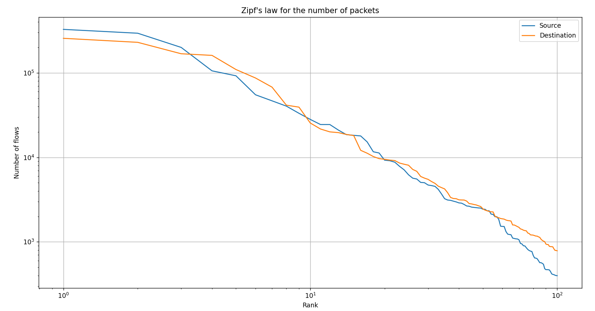

# AI Project - ENSIBS

| Auteurs | Contacts |
| --- | --- |
| Alexandre Quéré | quere.e2101514@etud.univ-ubs.fr |
| Enzo Denouë | denoue.e1807412@etud.univ-ubs.fr |

# Overview

This sub-project is part of our 5th year of cybersecurity engineering school. Mr. Pierre-François Marteau, researcher and professor at ENSIBS, asked us to developp a flow classification program as a premice of a bigger project about AI

This sub-project allows you to :

- Load and parse XML files of flows data.
- Index these flows with ElasticSearch
- Request some informations about these flows through ElasticSeach API

# Set up

## Requirements

Please run the following command in your command line to load the required Python libraries (Make sure to be in the right directory `/src`) :

```powershell
pip install -r requirements.txt
```

## Elastic connection

```python
# Constants for the Elasticsearch connection
PROTOCOL = "https"
HOST = "localhost"
PORT = 9200
ELASTIC_USERNAME = "elastic"
ELASTIC_PASSWORD = "uQksh15EsPWSzw1vq7s1"
CRT_PATH = "certs/http_ca.crt"
```

### Certificate

Make sure to put your certificate in the `/src/cert` folder and name it as is the `CRT_PATH` above.

### Server password

Be sure to give **your server password** in order to perform the Elasticsearch connection.

# Use

## Run indexation

First of all, run you ElasticSearch server with the following command : 

```powershell
elasticsearch
```

Make sure to be in the `Main.py` file. In order to run indexation for the first time, please follow these steps :

1. ***(OPTIONAL)*** Uncomment the following line in order to delete all the existing indexes : 

```python
# Delete all indexes at the beginning
bulk_indexer.delete_all_indexes()
```

***************************N.B. : The indexation of all files takes about 4 to 5 minutes.***************************

1. Uncomment the following lines in order to index ALL the XML files : 

```python
# Index all the XML files
for xml_file in XML_FILES:
    bulk_indexer.bulk_index_data(xml_file)
```

*********************************(OPTIONAL)********************************* You can uncomment the following lines if you want to index only one specific file : 

```python
# Index only one XML file
xml_file = XML_FILES[0]
bulk_indexer.bulk_index_data(xml_file)
```

1. Run the `Main.py` in the `/src` path with the following command (can depend of you system configuration) : 

```powershell
py .\Main.py
```

You should see a message indicating that the connection has been successfully established and the indexation starting :

```
C:\[...]\src> py .\Main.py
Connection to ElasticSearch server successful !
Index flows deleted successfully.
Indexes deleted successfully (except system indices).
Indexing TRAIN_ENSIBS\TestbedMonJun14Flows.xml . . .
Successfully indexed 171380 flows
Indexing TRAIN_ENSIBS\TestbedSatJun12Flows.xml . . .
Successfully indexed 133193 flows
```

**Strong recommendation : Please recomment out the line you have just uncommented in order to avoid indexing again all the files.**

## Access data

In order to access data, uncomment the searching function of your choice among thoses :

```python
###----------------------------------------------------------------------------------###
###------------------------------ Searching functions -------------------------------###
###----------------------------------------------------------------------------------###

    # If you want to get all the indexes
    sf.get_all_indexes()

    # If you want to get all the flows
    pprint.pprint(sf.match_all())

    # If you want to get all the protocols
    protocols = sf.get_protocols()
    pprint.pprint(protocols)

    # If you want to get all the flows for a given protocol
    protocol = "tcp_ip"
    flows_by_protocol = sf.get_flows_for_protocol(protocol)
    pprint.pprint(flows_by_protocol)

    # If you want to get the number of flows for each protocol
    nb_flows_per_protocol = sf.get_nb_flows_for_each_protocol()
    pprint.pprint(nb_flows_per_protocol)

		[ . . . ]
```

Here is an example of what we get using the `get_flows_for_application()` function with `Unknown_UDP` as argument :

```json
C:\[...]\src> py .\Main.py
Connection to ElasticSearch server successful !
Get flows for application Unknown_UDP
[{'_id': 'MFJSRIsBBh9r-bbjmbjT',
  '_index': 'flows',
  '_score': 3.25607,
  '_source': {'Tag': 'Normal',
              'appName': 'Unknown_UDP',
              'destination': '224.0.0.251',
              'destinationPayloadAsBase64': None,     
              'destinationPayloadAsUTF': None,        
              'destinationPort': '5353',
              'destinationTCPFlagsDescription': 'N/A',
              'direction': 'L2R',
              'protocolName': 'udp_ip',
              'source': '192.168.5.122',
              'sourcePayloadAsBase64': None,
              'sourcePort': '5353',
              'sourceTCPFlagsDescription': 'N/A',     
              'startDateTime': '2010-06-13T23:57:19', 
              'stopDateTime': '2010-06-14T00:11:23',  
              'totalDestinationBytes': '0',
              'totalDestinationPackets': '0',
              'totalSourceBytes': '16076',
              'totalSourcePackets': '178'}},
 {'_id': 'OVJSRIsBBh9r-bbjmbjT',
  '_index': 'flows',
  '_score': 3.25607,
  '_source': {'Tag': 'Normal',
              'appName': 'Unknown_UDP',
              'destination': '0.0.0.0',
              'destinationPayloadAsBase64': None,     
              'destinationPayloadAsUTF': None,        
              'destinationPort': '547',
              'destinationTCPFlagsDescription': 'N/A',
              'direction': 'R2R',
              'protocolName': 'udp_ip',
              'source': '0.0.0.0',
              'sourcePayloadAsBase64': None,
              'sourcePort': '546',
              'sourceTCPFlagsDescription': 'N/A',     
              'startDateTime': '2010-06-13T23:58:51', 
              'stopDateTime': '2010-06-13T23:59:54',  
              'totalDestinationBytes': '465',
              'totalDestinationPackets': '3',
              'totalSourceBytes': '0',
              'totalSourcePackets': '0'}},

[ . . . ]
```

## Draw the Zipf's law

Uncomment the following line in order to draw Zipf’s law for the number of packets :

```python
###----------------------------------------------------------------------------------###
###------------------------------ Drawer functions ----------------------------------###
###----------------------------------------------------------------------------------###

    # Draw the Zipf's law for the number of packets
    drawer.draw_zipf_for_each_nb_packets()
```

Here’s the result as an example : 

