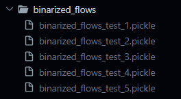
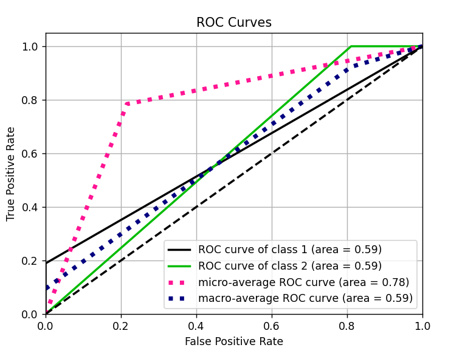
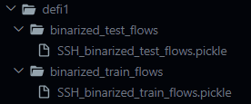
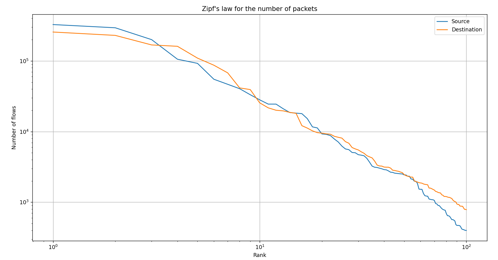

# AI Project - ENSIBS

| Auteurs | Contacts |
| --- | --- |
| Alexandre Quéré | quere.e2101514@etud.univ-ubs.fr |
| Enzo Denouë | denoue.e1807412@etud.univ-ubs.fr |

# Overview

This sub-project is part of our 5th year of cybersecurity engineering school. Mr. Pierre-François Marteau, researcher and professor at ENSIBS, asked us to developp a flow classification program as a premice of a bigger project about AI

This sub-project allows you to :

- Load and parse XML files of flows data.
- Index these flows with ElasticSearch
- Request some informations about these flows through ElasticSeach API

# Set up

## Requirements

Please run the following command in your command line to load the required Python libraries (Make sure to be in the right directory `/src`) :

```powershell
pip install -r requirements.txt
```

## Elastic connection

```python
# Constants for the Elasticsearch connection
PROTOCOL = "https"
HOST = "localhost"
PORT = 9200
ELASTIC_USERNAME = "elastic"
ELASTIC_PASSWORD = "uQksh15EsPWSzw1vq7s1"
CRT_PATH = "certs/http_ca.crt"
```

### Certificate

Make sure to put your certificate in the `/src/cert` folder and name it as is the `CRT_PATH` above.

### Server password

Be sure to give **your server password** in order to perform the Elasticsearch connection.

# Use

## First Run indexation

First of all, run you ElasticSearch server with the following command : 

```powershell
elasticsearch
```

You can ask for help with the following command :
```powershell
python Main.py -h
```

In order to run indexation for the first time you just have to run this command :
```powershell
python Main.py -index
```

You should see a message indicating that the connection has been successfully established and the indexation starting :

```powershell
C:\[...]\src> py .\Main.py -index
Connection to ElasticSearch server successful !
Index flows deleted successfully.
Indexes deleted successfully (except system indices).
Indexing TRAIN_ENSIBS\TestbedMonJun14Flows.xml . . .
Successfully indexed 171380 flows
Indexing TRAIN_ENSIBS\TestbedSatJun12Flows.xml . . .
Successfully indexed 133193 flows
```

**CAUTION : If you dont do this, you will raise many errors**

PS : You can also delete all the indexed data with the following command :
```powershell
python Main.py -delete
```
You will have to re-index the data if you want to access it again :
```powershell
C:\[...]\src> py .\Main.py -delete
Connection to ElasticSearch server successful !
Index flows deleted successfully.
Indexes deleted successfully (except system indices).

Please restart the program to index the XML files with -index.
```

## Run project

You can now run the project with the following command :

```powershell
python Main.py project [appName] [classifier]
```

**CAUTION : For the FIRST RUN, you have to add `-vect` flag (like bellow) in order to get flows from additional XML files and vectorize them. New files will be added to the dedicated folder contaning the vectorized flows.**
```powershell
python Main.py project [appName] [classifier] -vect
```
You should firstly get a message indicating that the connection has been successfully established and the classification preparation starting.
This classification preparation will do these things : 
1. It will get flows with the specified appName from indexed data and vectorize them.
2. It will split the vectorized flows between normal and attack flows.
3. It will create 5 subsets of the vectorized flows and write them to files.
4. These files will be saved in the `/binarized_flows` folder.

```powershell
C:\[...]\src> py .\Main.py project SSH KNN -vect
Connection to ElasticSearch server successful !
---------- Classification preparation ----------
Get flows for application SSH
Scrolling...
9689 flows retrieved for SSH
Successfull split between normal and attack flows.      
Vectorizing flows . . . WARNING : this may take a while.
Vectorizing flows . . . WARNING : this may take a while.
Vectors divided in 5 subsets and written to files.
Each subset composed of 1886 vectors ( 502 normal and 1384 attack ).
```


Then, the classification will start by loading these subsets from files (here the first vector of the first subset is displayed): 
```powershell
---------- Classification ----------
Get content from  5 files.
Subsets loaded from files.
subset n° 1 : 1886 vectors.
First vector of this subset is :  [73, '64', '64', [...], 1276353803, 1276353803, 1]
subset n° 2 : 1886 vectors.
First vector of this subset is :  [73, '64', '320', [...], 1276527084, 1276527129, 1]

[. . .] 
```

The training and testing will be processed with the specified classifier (here KNN) and for each Task (here Task 1) :
```powershell
---------------- KNN classifier with k = 1 ----------------

---------------- Task 1 ----------------

------------------------- Training . . . -------------------------

X_train : [[        73         64        320 ...         22 1276527084 1276527129]
 [        73         64        320 ...         22 1276527086 1276527132]
 [        73         64        384 ...         22 1276527088 1276527181]
 ...
 [        73        804       1851 ...         22 1276779539 1276779539]
 [        73        358        257 ...         22 1276563505 1276563505]
 [        73        358        257 ...         22 1276593416 1276593418]]

y_train : [1 1 1 ... 2 2 2]

Train done in 0.0009467601776123047 seconds

------------------------- Predicting . . . -------------------------

X_test : [[        73         64         64 ...         22 1276353803 1276353803]
 [        73         64         64 ...         22 1276353583 1276353583]
 [        73       3002      49570 ...         22 1276351145 1276351151]
 ...
 [        73       1555       2859 ...         22 1276360132 1276360138]
 [        73       1539       2789 ...         22 1276360128 1276360132]
 [        73       1469       2859 ...         22 1276360121 1276360128]]

y_test : [1 1 1 ... 2 2 2]

Prediction : [2 2 2 ... 2 2 2]
Probabilities : [[0. 1.]
 [0. 1.]
 [0. 1.]
 ...
 [0. 1.]
 [0. 1.]
 [0. 1.]]
Predict done in 0.4776113033294678 seconds

Task 1 ended in 0.4785580635070801 seconds
```

This show what vectors are used and what prediction is made with the associated probabilities.

Finally, the classification will end by evaluating the classifier with the following metrics : 
```powershell
------------------------- Evaluating . . . -------------------------

Precision : 0.8863763260748185
Recall : 0.5946215139442231
F1 score : 0.5950344900354791
```
And plotting the ROC curve :
```powershell
---------------------------- ROC curve -----------------------------

fpr : [0.         0.81075697 1.        ]
tpr : [0. 1. 1.]
thresholds : [inf  2.  1.]
```



## Run defi 1

You can now run the defi 1 with the following command :

```powershell
python Main.py defi1 [appName] [classifier] (-vect for the first run)
```

This will vectorize the flows from the `benchmark_HTTPWeb_test.xml` or `benchmark_SSH_test.xml` depending on the appName argument : 

```powershell
---------- Classification ----------
---------- Defi 1 ----------
- Training vectors for defi 1 loaded from file.
Testing flows for defi 1 loaded from xml file.
Number of testing flows :  2944
Vectorizing flows . . . WARNING : this may take a while.
Testing flows converted into testing vectors succesfully.
Number of testing vectors :  2944
Testing vectors loaded from file.
- Number of training vectors :  9436
```

The vectorized testing flows will be saved in the `defi1/binarized_test_flows/SSH_binarized_test_flows.pickle` and the vectorized training flows (from the indexed data) will be saved in the `defi1/binarized_training_flows/SSH_binarized_train_flows.pickle` :



The result of the classification are written in the `defi1/res/DENOUE_QUERE_SSH_1.json` file.

## Run defi 2


## Access specific data

In order to access data, uncomment the searching function of your choice among thoses :

```python
###----------------------------------------------------------------------------------###
###------------------------------ Searching functions -------------------------------###
###----------------------------------------------------------------------------------###

    # If you want to get all the indexes
    sf.get_all_indexes()

    # If you want to get all the flows
    pprint.pprint(sf.match_all())

    # If you want to get all the protocols
    protocols = sf.get_protocols()
    pprint.pprint(protocols)

    # If you want to get all the flows for a given protocol
    protocol = "tcp_ip"
    flows_by_protocol = sf.get_flows_for_protocol(protocol)
    pprint.pprint(flows_by_protocol)

    # If you want to get the number of flows for each protocol
    nb_flows_per_protocol = sf.get_nb_flows_for_each_protocol()
    pprint.pprint(nb_flows_per_protocol)

		[ . . . ]
```

Here is an example of what we get using the `get_flows_for_application()` function with `Unknown_UDP` as argument :

```json
C:\[...]\src> py .\Main.py
Connection to ElasticSearch server successful !
Get flows for application Unknown_UDP
[{'_id': 'MFJSRIsBBh9r-bbjmbjT',
  '_index': 'flows',
  '_score': 3.25607,
  '_source': {'Tag': 'Normal',
              'appName': 'Unknown_UDP',
              'destination': '224.0.0.251',
              'destinationPayloadAsBase64': None,     
              'destinationPayloadAsUTF': None,        
              'destinationPort': '5353',
              'destinationTCPFlagsDescription': 'N/A',
              'direction': 'L2R',
              'protocolName': 'udp_ip',
              'source': '192.168.5.122',
              'sourcePayloadAsBase64': None,
              'sourcePort': '5353',
              'sourceTCPFlagsDescription': 'N/A',     
              'startDateTime': '2010-06-13T23:57:19', 
              'stopDateTime': '2010-06-14T00:11:23',  
              'totalDestinationBytes': '0',
              'totalDestinationPackets': '0',
              'totalSourceBytes': '16076',
              'totalSourcePackets': '178'}},
 {'_id': 'OVJSRIsBBh9r-bbjmbjT',
  '_index': 'flows',
  '_score': 3.25607,
  '_source': {'Tag': 'Normal',
              'appName': 'Unknown_UDP',
              'destination': '0.0.0.0',
              'destinationPayloadAsBase64': None,     
              'destinationPayloadAsUTF': None,        
              'destinationPort': '547',
              'destinationTCPFlagsDescription': 'N/A',
              'direction': 'R2R',
              'protocolName': 'udp_ip',
              'source': '0.0.0.0',
              'sourcePayloadAsBase64': None,
              'sourcePort': '546',
              'sourceTCPFlagsDescription': 'N/A',     
              'startDateTime': '2010-06-13T23:58:51', 
              'stopDateTime': '2010-06-13T23:59:54',  
              'totalDestinationBytes': '465',
              'totalDestinationPackets': '3',
              'totalSourceBytes': '0',
              'totalSourcePackets': '0'}},

[ . . . ]
```

This can help you to access specific data in the indexed flows, to perform some statistics or debugging.

## Draw the Zipf's law

Uncomment the following line in order to draw Zipf’s law for the number of packets :

```python
###----------------------------------------------------------------------------------###
###------------------------------ Drawer functions ----------------------------------###
###----------------------------------------------------------------------------------###

    # Draw the Zipf's law for the number of packets
    drawer.draw_zipf_for_each_nb_packets()
```

Here’s the result as an example : 

